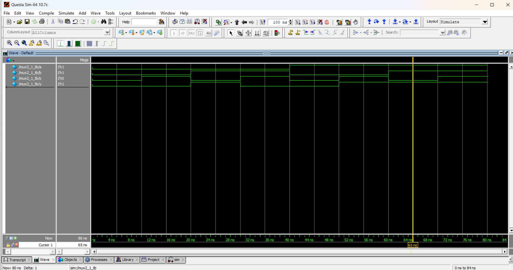

# 2:1 Multiplexer  

## 📘 Truth Table
| S | A | B | Y |
|---|---|---|---|
| 0 | X | B | B |
| 1 | A | X | A |

## 📝 Code
- [mux2_1.v](mux2_1.v) – RTL Design  
- [mux2_1_tb.v](mux2_1_tb.v) – Testbench  

## 🔍 Simulation
- Tool: QuestaSim / EDA Playground  
- ### 📊 Waveform Output
Here is the simulation waveform:  

- Output Verified

---

