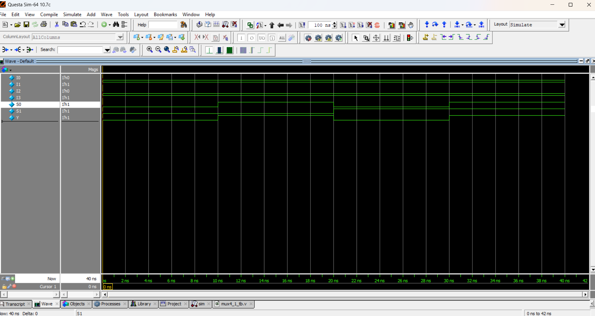

# 4:1 Multiplexer (MUX)

## Overview
A **4:1 Multiplexer** is a combinational circuit that selects one of four input signals and forwards it to a single output line, based on the values of the select lines.

- **Number of Inputs (Data):** 4 (I0, I1, I2, I3)  
- **Number of Select Lines:** 2 (S1, S0)  
- **Number of Outputs:** 1 (Y)  

## 📘 Truth Table

| S1 | S0 | Output (Y) |
|----|----|------------|
| 0  | 0  | I0         |
| 0  | 1  | I1         |
| 1  | 0  | I2         |
| 1  | 1  | I3         |

## 📝 Code
- [mux4_1.v](mux4_1.v) – RTL Design  
- [mux4_1_tb.v](mux4_1_tb.v) – Testbench  

## 🔍 Simulation
- Tool: QuestaSim / EDA Playground  
- ### 📊 Waveform Output
Here is the simulation waveform:  

- Output Verified

