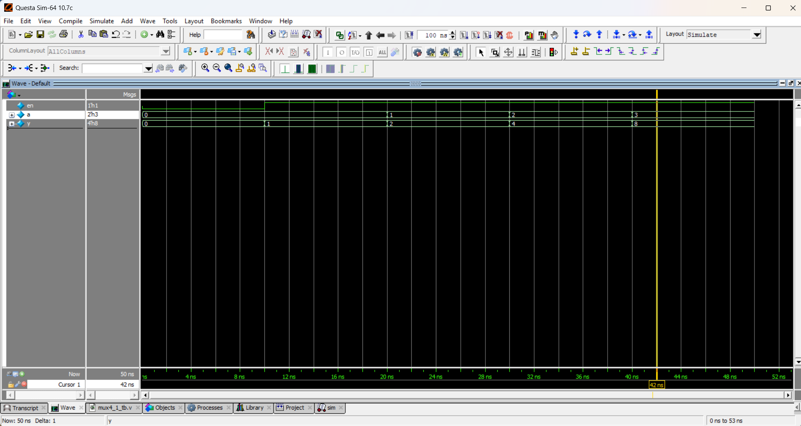

# 2-to-4 Decoder (Verilog)

## 📌 Description
A **2-to-4 line decoder** takes 2 input lines and decodes them into one of 4 outputs.  
Only one output will be active (logic high `1`) at a time, depending on the input combination, when enable is active.

## 📝 Truth Table

| Enable (EN) | A1 | A0 | Y3 | Y2 | Y1 | Y0 |
|-------------|----|----|----|----|----|----|
| 0           | X  | X  | 0  | 0  | 0  | 0  |
| 1           | 0  | 0  | 0  | 0  | 0  | 1  |
| 1           | 0  | 1  | 0  | 0  | 1  | 0  |
| 1           | 1  | 0  | 0  | 1  | 0  | 0  |
| 1           | 1  | 1  | 1  | 0  | 0  | 0  |

## 📝 Code
- [dec2_4.v](dec2_4.v) – RTL Design  
- [dec2_4_tb.v](dec2_4_tb.v) – Testbench  

## 🔍 Simulation
- Tool: QuestaSim / EDA Playground  
- ### 📊 Waveform Output
Here is the simulation waveform:  

- Output Verified
