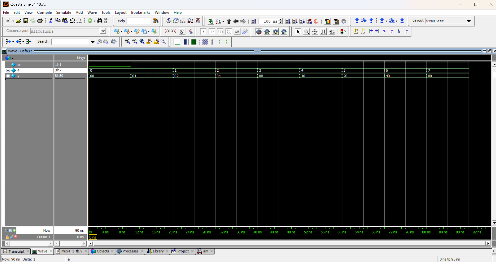

 # 3-to-8 Decoder (Verilog)

## 📌 Description
A **3-to-8 line decoder** takes 3 input lines and decodes them into one of 8 outputs.  
Only one output will be active (logic high `1`) at a time, depending on the input combination, when enable is active.

## 📝 Truth Table

| Enable (EN) | A2 | A1 | A0 | Y7 | Y6 | Y5 | Y4 | Y3 | Y2 | Y1 | Y0 |
|-------------|----|----|----|----|----|----|----|----|----|----|----|
| 0           | X  | X  | X  | 0  | 0  | 0  | 0  | 0  | 0  | 0  | 0  |
| 1           | 0  | 0  | 0  | 0  | 0  | 0  | 0  | 0  | 0  | 0  | 1  |
| 1           | 0  | 0  | 1  | 0  | 0  | 0  | 0  | 0  | 0  | 1  | 0  |
| 1           | 0  | 1  | 0  | 0  | 0  | 0  | 0  | 0  | 1  | 0  | 0  |
| 1           | 0  | 1  | 1  | 0  | 0  | 0  | 0  | 1  | 0  | 0  | 0  |
| 1           | 1  | 0  | 0  | 0  | 0  | 0  | 1  | 0  | 0  | 0  | 0  |
| 1           | 1  | 0  | 1  | 0  | 0  | 1  | 0  | 0  | 0  | 0  | 0  |
| 1           | 1  | 1  | 0  | 0  | 1  | 0  | 0  | 0  | 0  | 0  | 0  |
| 1           | 1  | 1  | 1  | 1  | 0  | 0  | 0  | 0  | 0  | 0  | 0  |

## 📝 Code
- [dec3_8.v](dec3_8.v) – RTL Design  
- [dec3_8_tb.v](dec3_8_tb.v) – Testbench  

## 🔍 Simulation
- Tool: QuestaSim / EDA Playground  
- ### 📊 Waveform Output
Here is the simulation waveform:  

- Output Verified
