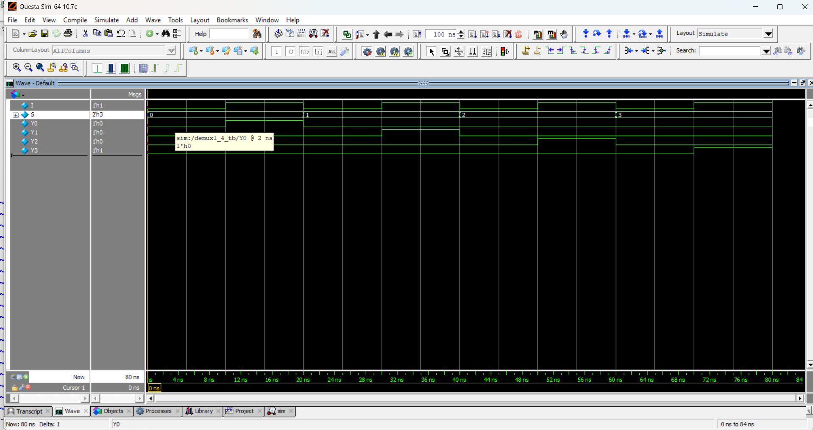

# 1-to-4 Demultiplexer (DEMUX)

## Overview
A **1-to-4 Demultiplexer** (DEMUX) takes a single input and routes it to one of the four outputs based on a 2-bit select line. Only one output is active at a time, corresponding to the select line, while all others remain `0`.

- **Number of Inputs (Data):** 1 (I)  
- **Number of Select Lines:** 2 (S0,S1)  
- **Number of Outputs:** 4 (Y0,Y1,Y2,Y3)  

## 📘 Truth Table

| Select S1 S0 | Y0 | Y1 | Y2 | Y3 |
|--------------|----|----|----|----|
| 00           | I  | 0  | 0  | 0  |
| 01           | 0  | I  | 0  | 0  |
| 10           | 0  | 0  | I  | 0  |
| 11           | 0  | 0  | 0  | I  |

---

## 📝 Code
- [demux1_4.v](demux1_4.v) – RTL Design  
- [demux1_4_tb.v](demux1_4_tb.v) – Testbench  

## 🔍 Simulation
- Tool: QuestaSim / EDA Playground  
- ### 📊 Waveform Output
Here is the simulation waveform:  

Output Verified!
