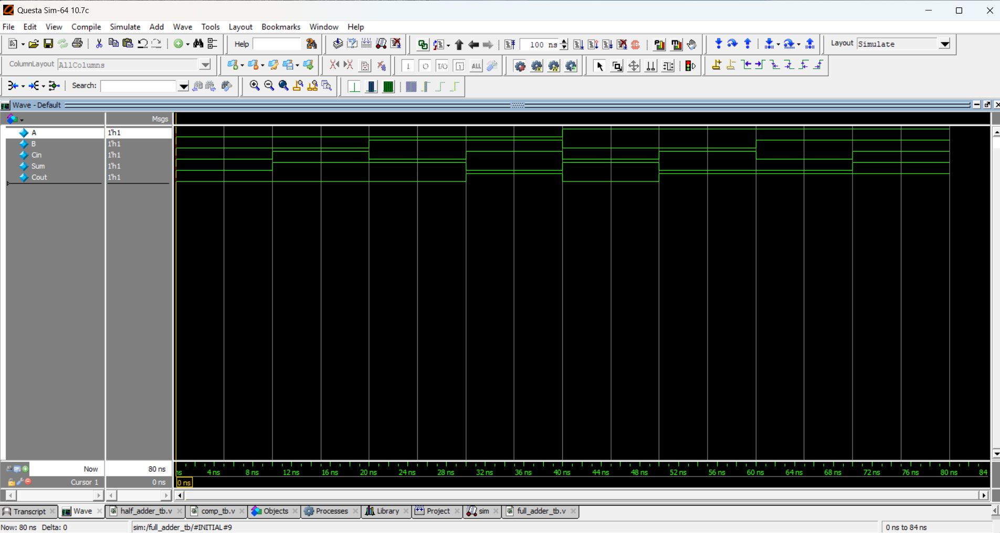

# Full Adder

## 📘 Theory
A **Full Adder** is a combinational circuit that performs the **addition of three binary inputs**:  
- Two significant bits (**A, B**)  
- A carry input (**Cin**)  

It produces two outputs:  
- **Sum** → XOR of the inputs  
- **Cout (Carry out)** → generated when two or more inputs are 1  

---

## 📝 Truth Table

| A | B | Cin | Sum | Cout |
|---|---|-----|-----|------|
| 0 | 0 |  0  |  0  |  0   |
| 0 | 0 |  1  |  1  |  0   |
| 0 | 1 |  0  |  1  |  0   |
| 0 | 1 |  1  |  0  |  1   |
| 1 | 0 |  0  |  1  |  0   |
| 1 | 0 |  1  |  0  |  1   |
| 1 | 1 |  0  |  0  |  1   |
| 1 | 1 |  1  |  1  |  1   |

---

## 📝 Code

[full_adder.v](full_adder.v) – RTL Design  

[full_adder_tb.v](full_adder_tb.v) – Testbench  

## 🔍 Simulation

- Tool: QuestaSim / EDA Playground  

- ### 📊 Waveform Output

Here is the simulation waveform:  

Output Verified!

