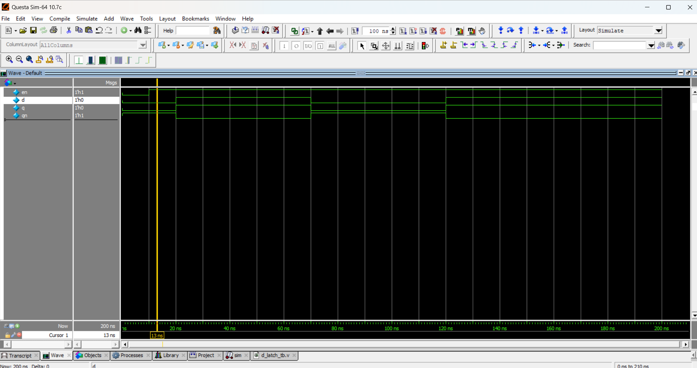

# 🔒 D Latch (Data Latch)

## 📖 Introduction
A **D Latch** (Data Latch or Transparent Latch) is a **level-sensitive** storage element.  
It stores 1-bit of data when the enable (`EN`) signal is active.  

- When **EN = 1**, the output `Q` follows the input `D`.  
- When **EN = 0**, the output `Q` holds its previous value (latches the data).  

---

## ⚡ Truth Table

| Enable (EN) | D | Q (Next State) |
|-------------|---|----------------|
| 0           | X | Q (no change)  |
| 1           | 0 | 0              |
| 1           | 1 | 1              |

---
## 📝 Code

[d_latch.v](d_latch.v) – RTL Design  

[d_latch_tb.v](d_latch_tb.v) – Testbench  

## 🔍 Simulation

- Tool: QuestaSim / EDA Playground  

- ### 📊 Waveform Output

Here is the simulation waveform:  

Output Verified!

