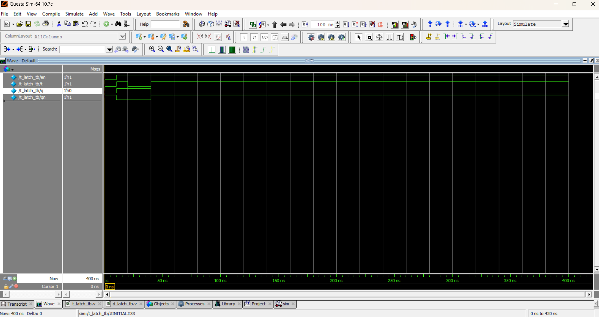

# 🔀 T Latch (Toggle Latch)

## 📖 Introduction
A **T Latch** (Toggle Latch) is a **level-sensitive** storage element.  
It works like a D latch, but the input is **T (Toggle)** instead of D.

- When **EN = 1**:
  - If **T = 0**, the output `Q` holds its previous value.  
  - If **T = 1**, the output `Q` toggles (flips its state).  
- When **EN = 0**, the output `Q` holds its value (no change).  

---

## ⚡ Truth Table

| Enable (EN) | T | Q (Next State) |
|-------------|---|----------------|
| 0           | X | Q (no change)  |
| 1           | 0 | Q (no change)  |
| 1           | 1 | Q' (toggle)    |

---

## 📝 Code

[t_latch.v](t_latch.v) – RTL Design  

[t_latch_tb.v](t_latch_tb.v) – Testbench  

## 🔍 Simulation

- Tool: QuestaSim / EDA Playground  

- ### 📊 Waveform Output

Here is the simulation waveform:  

Output Verified!
