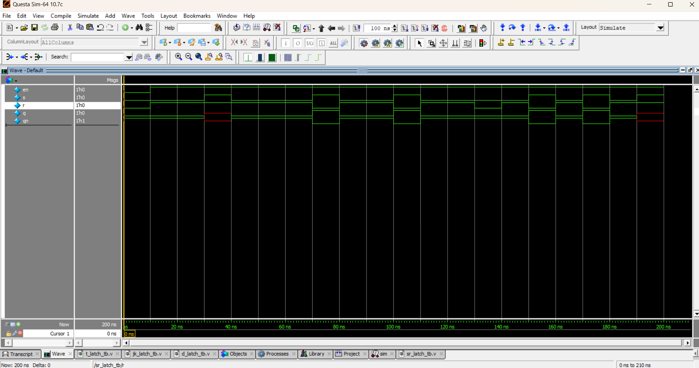

 🔀 SR Latch (Level-Sensitive)

## 📘 Theory
The **SR (Set-Reset) latch** is a basic memory element used in digital circuits.  
It has two inputs **S (Set)** and **R (Reset)** along with an **Enable (En)** signal.  
The output **Q** stores a logic value until changed by the inputs.  

- **Set (S=1, R=0)** → Q = 1  
- **Reset (S=0, R=1)** → Q = 0  
- **Hold (S=0, R=0)** → Q retains its previous state  
- **Invalid (S=1, R=1)** → Not allowed (both set and reset active at the same time)  

---

## 📝 Truth Table

| Enable | S | R | Q(next)     |
|--------|---|---|-------------|
|   0    | x | x | Q (Hold)    |
|   1    | 0 | 0 | Q (Hold)    |
|   1    | 0 | 1 | 0 (Reset)   |
|   1    | 1 | 0 | 1 (Set)     |
|   1    | 1 | 1 | Invalid (X) |

---

## 📝 Code

[sr_latch.v](sr_latch.v) – RTL Design  

[sr_latch_tb.v](sr_latch_tb.v) – Testbench  

## 🔍 Simulation

- Tool: QuestaSim / EDA Playground  

- ### 📊 Waveform Output

Here is the simulation waveform:  

Output Verified!
