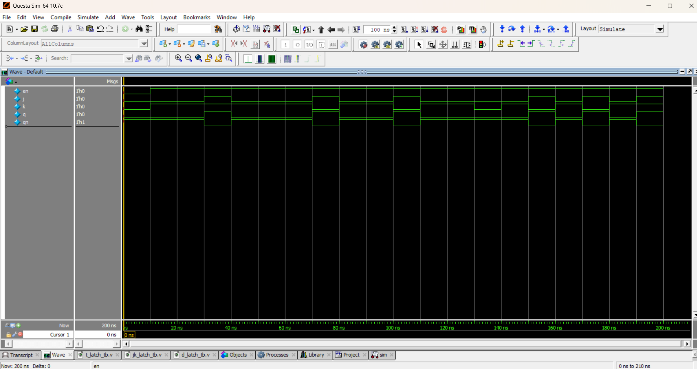

# 🔀 JK Latch (Level-Sensitive)

## 📘 Theory
The **JK latch** is a refinement of the SR latch.  
It has two inputs **J (Set)** and **K (Reset)** with an enable signal.  

- When **J=0, K=0** → No change (Q holds previous value).  
- When **J=0, K=1** → Reset (Q=0).  
- When **J=1, K=0** → Set (Q=1).  
- When **J=1, K=1** → Toggle (Q = Q’).  

This removes the "invalid state" problem of the SR latch.

---

## 📝 Truth Table

| Enable | J | K | Q(next)      |
|--------|---|---|--------------|
|   0    | x | x | Q (Hold)     |
|   1    | 0 | 0 | Q (Hold)     |
|   1    | 0 | 1 | 0 (Reset)    |
|   1    | 1 | 0 | 1 (Set)      |
|   1    | 1 | 1 | Q’ (Toggle)  |

---

## 📝 Code

[jk_latch.v](jk_latch.v) – RTL Design  

[jk_latch_tb.v](jk_latch_tb.v) – Testbench  

## 🔍 Simulation

- Tool: QuestaSim / EDA Playground  

- ### 📊 Waveform Output

Here is the simulation waveform:  

Output Verified!
