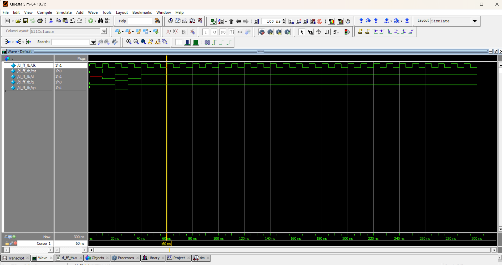

# ⏱️ D Flip-Flop (Edge-Triggered)

## 📘 Theory
The **D (Data or Delay) Flip-Flop** is one of the most commonly used sequential logic circuits.  
It stores a single bit of data and transfers the input **D** to the output **Q** on the **clock edge**.  

- **On rising edge of CLK (↑)** → Q takes the value of D.  
- **If Reset = 0** → Q is cleared to 0.  
- **If Reset = 1 and CLK doesn’t trigger** → Q retains its previous value.  

It eliminates the **invalid state problem** of the SR latch.

---

## 📝 Truth Table

| CLK (↑ edge) | D | Reset | Q(next)   |
|--------------|---|-------|-----------|
|      ↑       | 0 |   1   |     0     |
|      ↑       | 1 |   1   |     1     |
|      -       | x |   1   | Q (Hold)  |
|      x       | x |   0   |     0     |

---

## 📝 Code

[d_ff.v](d_ff.v) – RTL Design  

[d_ff_tb.v](d_ff_tb.v) – Testbench  

## 🔍 Simulation

- Tool: QuestaSim / EDA Playground  

- ### 📊 Waveform Output

Here is the simulation waveform:  

Output Verified!
