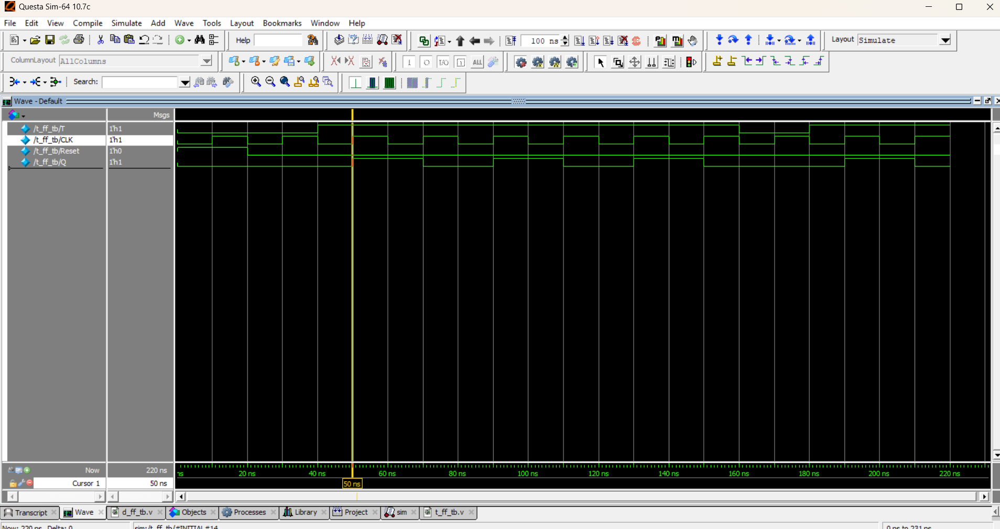

# 🔀 T Flip-Flop (Toggle Flip-Flop)

## 📘 Introduction
A **T Flip-Flop** (Toggle Flip-Flop) is a sequential logic circuit that changes its state on every clock edge when the input `T = 1`.  
- If `T = 0`, it **holds the previous state**.  
- If `T = 1`, it **toggles** the output (from 0 → 1 or 1 → 0).  

T Flip-Flops are commonly used in **counters, frequency dividers, and control systems**.

---

## 📝 Truth Table

| T | Q (previous) | Q (next) |
|---|--------------|-----------|
| 0 |      0       |     0     |
| 0 |      1       |     1     |
| 1 |      0       |     1     |
| 1 |      1       |     0     |

---
## 📝 Code

[t_ff.v](t_ff.v) – RTL Design  

[t_ff_tb.v](t_ff_tb.v) – Testbench  

## 🔍 Simulation

- Tool: QuestaSim / EDA Playground  

- ### 📊 Waveform Output

Here is the simulation waveform:  

Output Verified!
