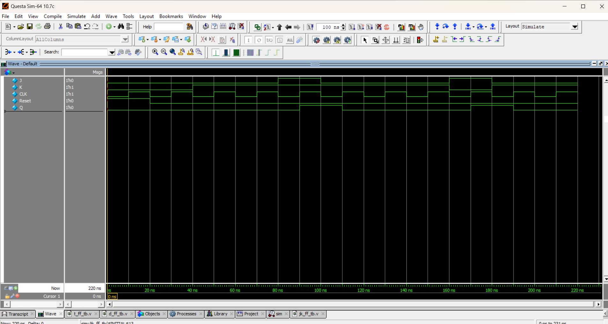

# 🔀 JK Flip-Flop

## 📘 Introduction
A **JK Flip-Flop** is an improved version of the SR Flip-Flop that eliminates the **invalid state**.  
It has two inputs:  
- **J (Set)**  
- **K (Reset)**  

The JK Flip-Flop operates as:  
- Works like **SR Flip-Flop** when inputs are 0 or 1.  
- When **J = K = 1**, it **toggles** the output on every clock edge.  

---

## 📝 Truth Table

| J | K | Q (previous) | Q (next) | Description      |
|---|---|--------------|----------|------------------|
| 0 | 0 |      0       |    0     | No Change        |
| 0 | 0 |      1       |    1     | No Change        |
| 0 | 1 |      0       |    0     | Reset to 0       |
| 0 | 1 |      1       |    0     | Reset to 0       |
| 1 | 0 |      0       |    1     | Set to 1         |
| 1 | 0 |      1       |    1     | Set to 1         |
| 1 | 1 |      0       |    1     | Toggle (0 → 1)   |
| 1 | 1 |      1       |    0     | Toggle (1 → 0)   |

---
## 📝 Code

[jk_ff.v](jk_ff.v) – RTL Design  

[jk_ff_tb.v](jk_ff_tb.v) – Testbench  

## 🔍 Simulation

- Tool: QuestaSim / EDA Playground  

- ### 📊 Waveform Output

Here is the simulation waveform:  

Output Verified!
