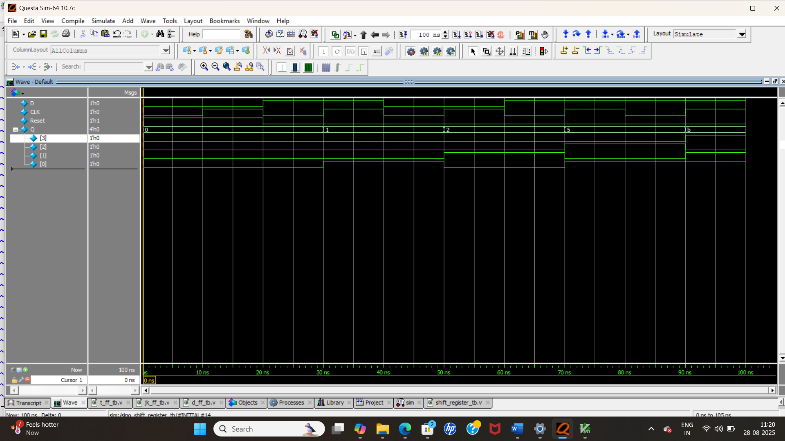

# 📦 Shift Register

## 📘 Introduction
A **Shift Register** is a group of flip-flops connected in series, used to **store** and **shift data**.  
On each clock pulse, the data moves (or "shifts") by one position either **left** or **right**.  

Shift registers are widely used in **data storage, data transfer, serial-to-parallel conversion, and parallel-to-serial conversion**.

---

## 🔄 Types of Shift Registers
1. **SISO (Serial-In Serial-Out)**  
   Data enters and exits serially.  

2. **SIPO (Serial-In Parallel-Out)**  
   Data enters serially, output available in parallel.  

3. **PISO (Parallel-In Serial-Out)**  
   Data enters in parallel, exits serially.  

4. **PIPO (Parallel-In Parallel-Out)**  
   Data enters and exits in parallel.  

---
# 📦 Example :  4-bit Serial-In Parallel-Out (SIPO) Shift Register

## 📘 Introduction
A **Serial-In Parallel-Out (SIPO) Shift Register** accepts data serially (bit by bit) and outputs it in **parallel**.  
This is useful when data is received serially (one bit at a time) but needs to be processed in parallel by the system.

---

## 📝 Code

[shift_register.v](shift_register.v) – RTL Design  

[shift_register_tb.v](shift_register_tb.v) – Testbench  

## 🔍 Simulation

- Tool: QuestaSim / EDA Playground  

- ### 📊 Waveform Output

Here is the simulation waveform:  

Output Verified!
