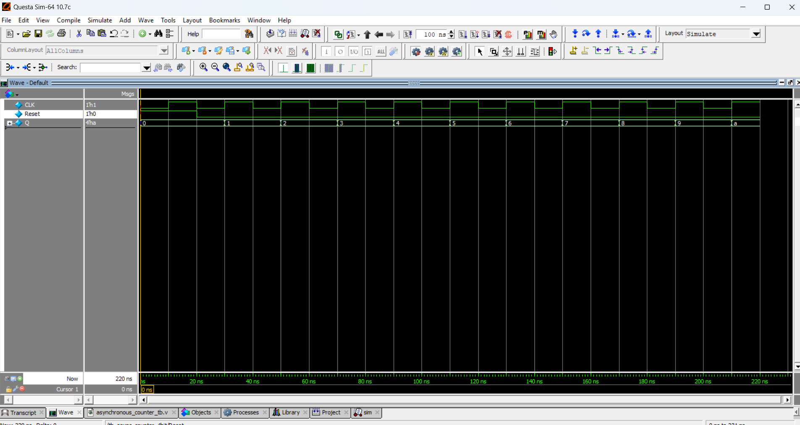

# ⏱️ 4-bit Asynchronous (Ripple) Counter

## 📘 Introduction
A **4-bit Asynchronous Counter** (also called a Ripple Counter) is a counter where the flip-flops are not clocked simultaneously.  
- The first flip-flop is triggered by the external clock.  
- Each subsequent flip-flop is triggered by the output of the previous flip-flop.  

This causes a "ripple" effect in counting.  

---

## 📝 Code

[asynchronous_counter.v](asynchronous_counter.v) – RTL Design  

[asynchronous_counter_tb.v](asynchronous_counter_tb.v) – Testbench  

## 🔍 Simulation

- Tool: QuestaSim / EDA Playground  

- ### 📊 Waveform Output

Here is the simulation waveform:  

Output Verified!
