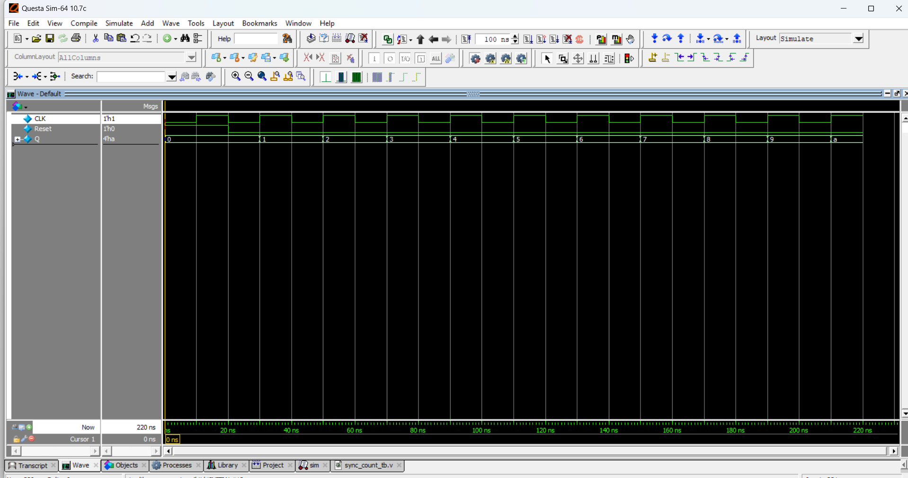

# ⏱️ 4-bit Synchronous Counter

## 📘 Introduction
A **4-bit Synchronous Counter** is a counter where **all flip-flops are triggered simultaneously** by the same clock signal.  
Unlike asynchronous (ripple) counters, synchronous counters eliminate the propagation delay because all bits change state together.  

---
## 📝 Code

[sync_count.v](sync_count.v) – RTL Design  

[sync_count_tb.v](sync_count_tb.v) – Testbench  

## 🔍 Simulation

- Tool: QuestaSim / EDA Playground  

- ### 📊 Waveform Output

Here is the simulation waveform:  

Output Verified!

