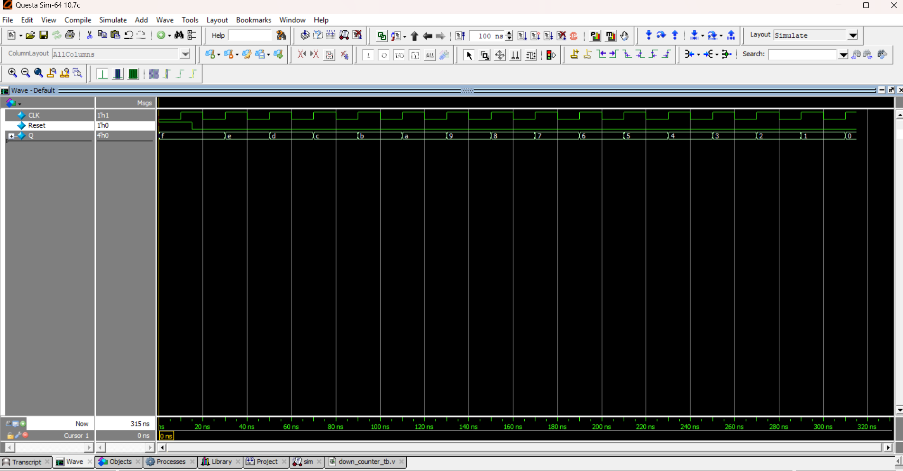

# ⏱️ 4-bit Ripple DOWN Counter

## 📘 Introduction
A **4-bit Ripple DOWN Counter** is an asynchronous counter where each flip-flop is triggered by the **output of the previous flip-flop**.  
- The first flip-flop toggles with the external clock.  
- Each subsequent flip-flop toggles when the **previous output goes from LOW → HIGH** (rising edge).  
- This produces a **decrementing (DOWN) count sequence**.  

⚠️ In real hardware, ripple counters introduce **propagation delay** between bit transitions.  
In Verilog simulation, you can add `#delay` to visualize this effect.  

---
## 📝 Code

[down_counter.v](down_counter.v) – RTL Design  

[down_counter_tb.v](down_counter_tb.v) – Testbench  

## 🔍 Simulation

- Tool: QuestaSim / EDA Playground  

- ### 📊 Waveform Output

Here is the simulation waveform:  

Output Verified!

