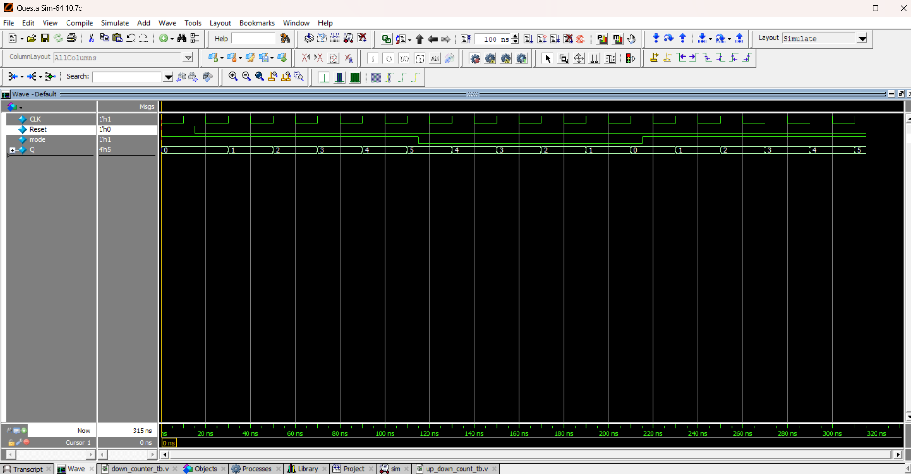

# 🔄 4-bit Up-Down Counter

## 📘 Introduction
A **4-bit Up-Down Counter** is a sequential circuit that can **increment (UP)** or **decrement (DOWN)** its value based on a control input:
- `mode = 1` → **UP Counter** (0000 → 1111)  
- `mode = 0` → **DOWN Counter** (1111 → 0000)  

It is usually implemented using **synchronous design**, so all flip-flops are triggered by the same clock.

---
## 📝 Code

[up_down_count.v](up_down_count.v) – RTL Design  

[up_down_count_tb.v](up_down_count_tb.v) – Testbench  

## 🔍 Simulation

- Tool: QuestaSim / EDA Playground  

- ### 📊 Waveform Output

Here is the simulation waveform:  

Output Verified!

