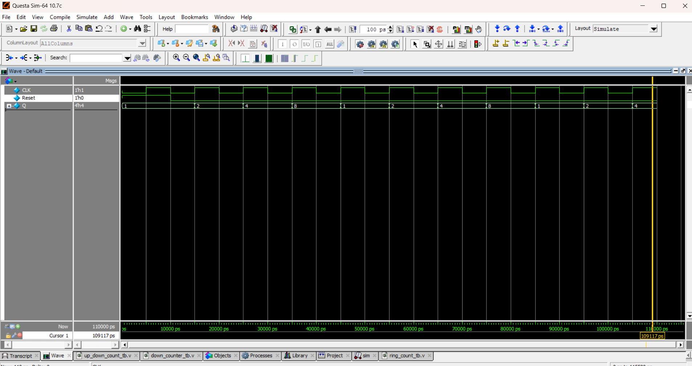

## 🔹 Ring Counter
A **Ring Counter** is a type of counter where the **output of the last flip-flop is fed back to the input of the first flip-flop**.  
It cycles a single `1` (or `0`) through the register.

| Clock | Q (Binary)    |
| ----- | ------------- |
| 0     | 0001          |
| 1     | 0010          |
| 2     | 0100          |
| 3     | 1000          |
| 4     | 0001 (Repeat) |

Ring Counter → Cycles through N states (for N flip-flops).

## 📝 Code

[ring_count.v](ring_count.v) – RTL Design  

[ring_count_tb.v](ring_count_tb.v) – Testbench  

## 🔍 Simulation

- Tool: QuestaSim / EDA Playground  

- ### 📊 Waveform Output

Here is the simulation waveform:  

Output Verified!

