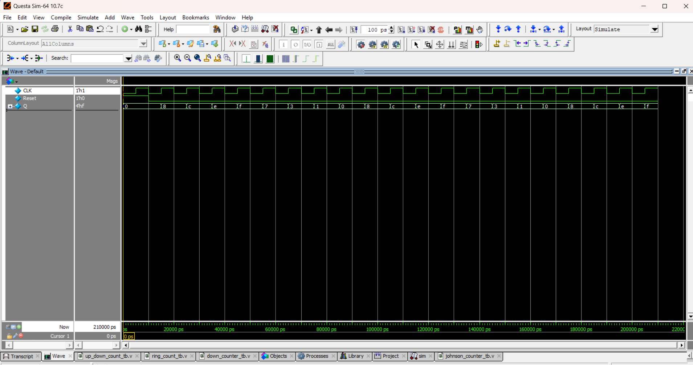

Johnson Counter (Twisted Ring Counter)

A Johnson Counter (or Twisted Ring Counter) feeds back the inverted output of the last flip-flop into the input of the first flip-flop.
This produces 2N unique states for N flip-flops.
| Clock | Q (Binary)    |
| ----- | ------------- |
| 0     | 0000          |
| 1     | 1000          |
| 2     | 1100          |
| 3     | 1110          |
| 4     | 1111          |
| 5     | 0111          |
| 6     | 0011          |
| 7     | 0001          |
| 8     | 0000 (Repeat) |
Johnson Counter → Cycles through 2N states (for N flip-flops).
## 📝 Code

[johnson_counter.v](johnson_counter.v) – RTL Design  

[johnson_counter_tb.v](johnson_counter_tb.v) – Testbench  

## 🔍 Simulation

- Tool: QuestaSim / EDA Playground  

- ### 📊 Waveform Output

Here is the simulation waveform:  

Output Verified!

