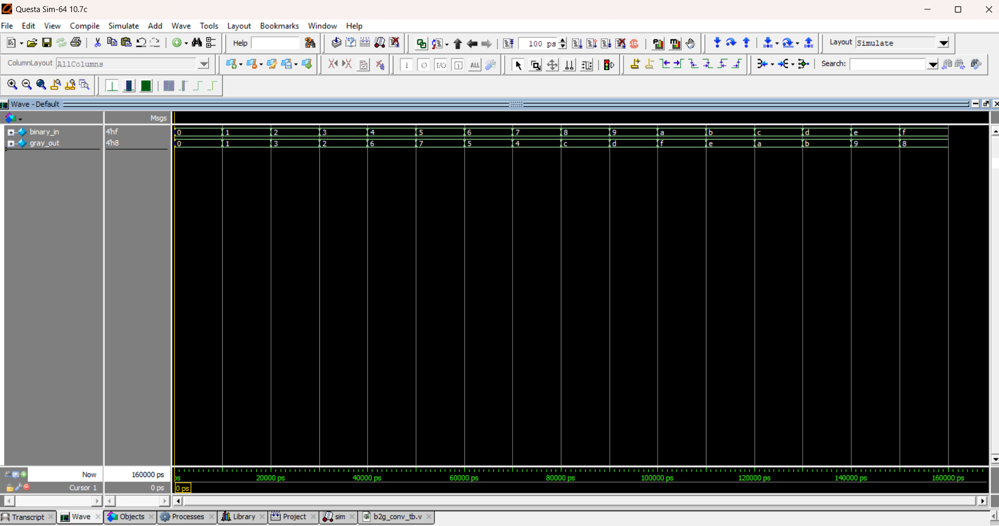

# 🔄 Binary to Gray Code Converter

## 📘 Introduction
- **Gray Code** is a binary numeral system where two successive values differ in only one bit.  
- It is widely used in **error correction, Karnaugh maps, encoders, and communication systems**.  
- This reduces errors during transitions, especially in hardware where simultaneous bit changes can cause glitches.  

---
| Binary (B3 B2 B1 B0) | Gray (G3 G2 G1 G0) |
| -------------------- | ------------------ |
| 0000                 | 0000               |
| 0001                 | 0001               |
| 0010                 | 0011               |
| 0011                 | 0010               |
| 0100                 | 0110               |
| 0101                 | 0111               |
| 0110                 | 0101               |
| 0111                 | 0100               |
| 1000                 | 1100               |
| 1001                 | 1101               |
| 1010                 | 1111               |
| 1011                 | 1110               |
| 1100                 | 1010               |
| 1101                 | 1011               |
| 1110                 | 1001               |
| 1111                 | 1000               |

📊 Key Notes

Conversion formula:

Gray[N-1] = Binary[N-1] (MSB remains same)

Gray[i] = Binary[i+1] XOR Binary[i] for i < N-1

This ensures only 1-bit change between successive numbers.

## 📝 Code

[b2g_conv.v]( b2g_conv.v) – RTL Design  

[b2g_conv_tb.v]( b2g_conv_tb.v) – Testbench  

## 🔍 Simulation

- Tool: QuestaSim / EDA Playground  

- ### 📊 Waveform Output

Here is the simulation waveform:  

Output Verified!

