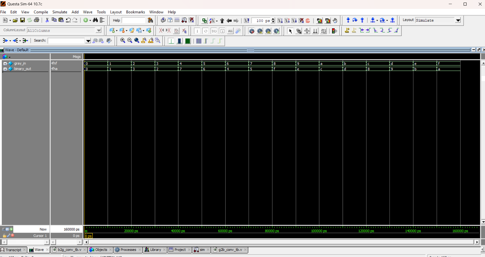

# 🔄 Gray to Binary Converter

## 📘 Introduction
- **Gray Code** ensures that only one bit changes between successive numbers.  
- Sometimes we need to **convert back from Gray to Binary**, especially in digital circuits like **encoders, communication systems, and FSMs**.  
- Conversion is slightly more complex than Binary → Gray.

---
| Gray (G3 G2 G1 G0) | Binary (B3 B2 B1 B0) |
| ------------------ | -------------------- |
| 0000               | 0000                 |
| 0001               | 0001                 |
| 0011               | 0010                 |
| 0010               | 0011                 |
| 0110               | 0100                 |
| 0111               | 0101                 |
| 0101               | 0110                 |
| 0100               | 0111                 |
| 1100               | 1000                 |
| 1101               | 1001                 |
| 1111               | 1010                 |
| 1110               | 1011                 |
| 1010               | 1100                 |
| 1011               | 1101                 |
| 1001               | 1110                 |
| 1000               | 1111                 |
## 📝 Code

[g2b_conv.v]( g2b_conv.v) – RTL Design  

[g2b_conv_tb.v]( g2b_conv_tb.v) – Testbench  

## 🔍 Simulation

- Tool: QuestaSim / EDA Playground  

- ### 📊 Waveform Output

Here is the simulation waveform:  

Output Verified!

