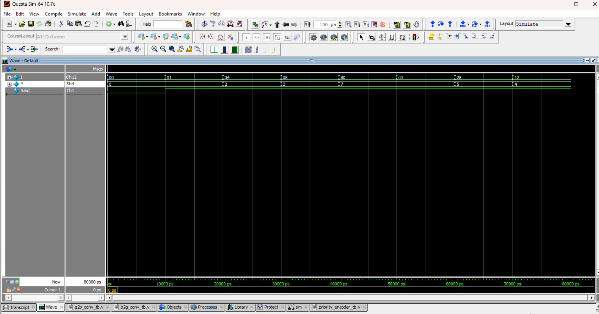

# 🔢 8-to-3 Priority Encoder

## 📘 Introduction
- An **8-to-3 Priority Encoder** encodes 8 input lines into a 3-bit binary output.  
- If multiple inputs are active, the **highest-priority input (I7 highest → I0 lowest)** is selected.  
- Useful in **interrupt controllers, arbiters, and CPU instruction handling**.

---
| Inputs (I7..I0) | Output (Y2 Y1 Y0) | Valid |
| --------------- | ----------------- | ----- |
| 00000000        | 000               | 0     |
| 00000001        | 000               | 1     |
| 0000001x        | 001               | 1     |
| 000001xx        | 010               | 1     |
| 00001xxx        | 011               | 1     |
| 0001xxxx        | 100               | 1     |
| 001xxxxx        | 101               | 1     |
| 01xxxxxx        | 110               | 1     |
| 1xxxxxxx        | 111               | 1     |
🔹 x = don’t care
🔹 Higher index input dominates
## 📝 Code

[priority_encoder.v]( priority_encoder.v) – RTL Design  

[priority_encoder_tb.v]( priority_encoder_tb.v) – Testbench  

## 🔍 Simulation

- Tool: QuestaSim / EDA Playground  

- ### 📊 Waveform Output

Here is the simulation waveform:  

Output Verified!

