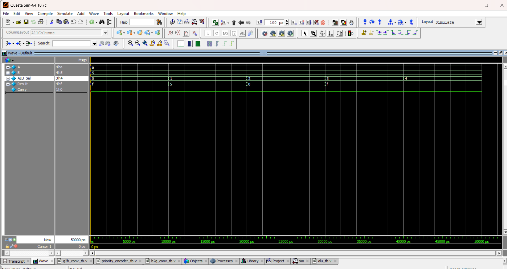

# ⚙️ 4-bit ALU (Arithmetic Logic Unit)

## 📘 Introduction
- An **Arithmetic Logic Unit (ALU)** is the core component of a CPU that performs **arithmetic and logic operations**.  
- This ALU supports **5 operations**:  
  1. Addition (+)  
  2. Subtraction (-)  
  3. Bitwise AND  
  4. Bitwise OR  
  5. Bitwise XOR  

---
| ALU\_Sel | Operation | Example (A=1010, B=0101) | Result | Carry |
| -------- | --------- | ------------------------ | ------ | ----- |
| 000      | Add       | 1010 + 0101              | 1111   | 0     |
| 001      | Subtract  | 1010 - 0101              | 0101   | 0     |
| 010      | AND       | 1010 & 0101              | 0000   | 0     |
| 011      | OR        | 1010 \| 0101             | 1111   | 0     |
| 100      | XOR       | 1010 ^ 0101              | 1111   | 0     |

## 📝 Code

[alu.v]( alu.v) – RTL Design  

[alu_tb.v]( alu_tb.v) – Testbench  

## 🔍 Simulation

- Tool: QuestaSim / EDA Playground  

- ### 📊 Waveform Output

Here is the simulation waveform:  

Output Verified!

