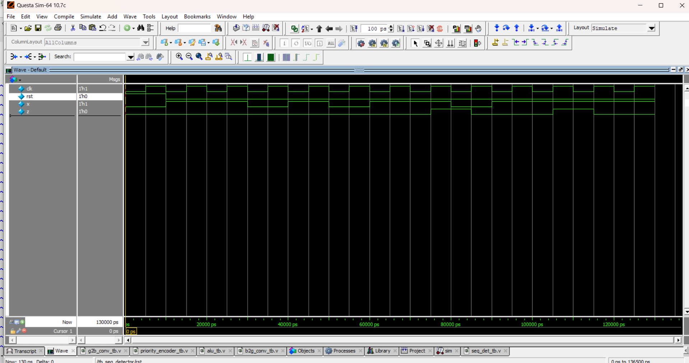

# 🔍 Sequence Detector (Detect "1011")

## 📘 Introduction
- A **sequence detector** detects a particular bit pattern in a serial input stream.  
- Here, we detect the sequence **"1011"** using a **Moore FSM**.  
- Output `z = 1` when the sequence "1011" is found.  

---
📝 FSM State Diagram

S0 → Initial state (no match)

S1 → Got 1

S2 → Got 10

S3 → Got 101

S4 → Got 1011 (detection state, z=1)

✅ Example Run

Input sequence = 1101011011

At last four bits 1011 → Output z=1

## 📝 Code

[seq_det.v]( seq_det.v) – RTL Design  

[seq_det_tb.v]( seq_det_tb.v) – Testbench  

## 🔍 Simulation

- Tool: QuestaSim / EDA Playground  

- ### 📊 Waveform Output

Here is the simulation waveform:  

Output Verified!

