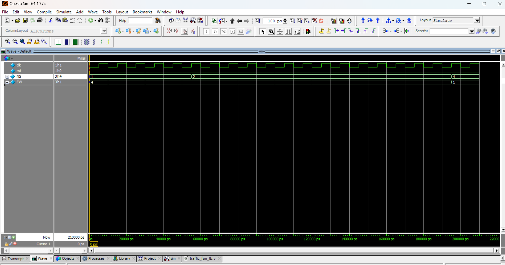

# 🚦 Traffic Light Controller (FSM)

## 📘 Introduction
- A **traffic light controller** is a sequential circuit designed using a **Finite State Machine (FSM)**.  
- It controls the lights for two roads:  
  - **North-South (NS)**  
  - **East-West (EW)**  
- Each direction cycles through **Green → Yellow → Red**.  

---
📝 FSM State Diagram

S0 → NS = Green, EW = Red

S1 → NS = Yellow, EW = Red

S2 → NS = Red, EW = Green

S3 → NS = Red, EW = Yellow

✅ Example Run

Time 0–40 ns → NS Green, EW Red

Time 40–60 ns → NS Yellow, EW Red

Time 60–100 ns → NS Red, EW Green

Time 100–120 ns → NS Red, EW Yellow

Then cycle repeats

📌 Applications

Smart traffic control systems

Highway signal management

Urban road safety systems

## 📝 Code

[traffic_fsm.v]( traffic_fsm.v) – RTL Design  

[traffic_fsm_tb.v]( traffic_fsm_tb.v) – Testbench  

## 🔍 Simulation

- Tool: QuestaSim / EDA Playground  

- ### 📊 Waveform Output

Here is the simulation waveform:  

Output Verified!

