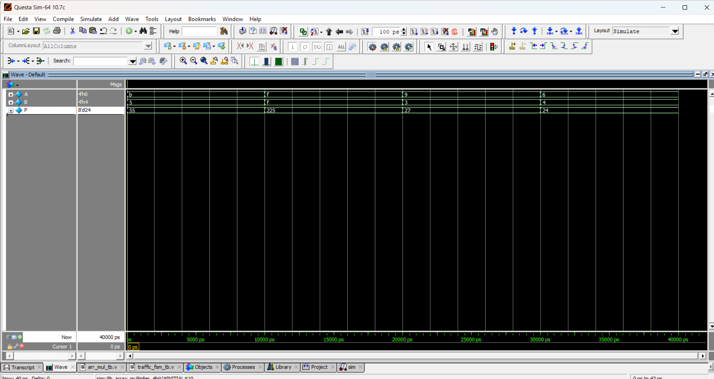

# ✖️ 4-bit Array Multiplier

## 📘 Introduction
- An **array multiplier** is a combinational circuit used to multiply two binary numbers.  
- It uses a series of **AND gates** to generate partial products, and then adds them using **adders**.  
- Here we design a **4-bit × 4-bit multiplier**.

---
📝 Example (Binary Multiplication)

Multiply A = 1011 (11) and B = 0101 (5)

        1011   (11)
  x     0101   (5)
  -------------
        1011   (pp0)
  +   0000    (pp1 << 1)
  +  1011     (pp2 << 2)
  + 0000      (pp3 << 3)
  -------------
      00110111 (55)

✅ Output = 110111 (55)

## 📝 Code

[arr_mul.v]( arr_mul.v) – RTL Design  

[arr_mul_tb.v]( arr_mul_tb.v) – Testbench  

## 🔍 Simulation

- Tool: QuestaSim / EDA Playground  

- ### 📊 Waveform Output

Here is the simulation waveform:  

Output Verified!

