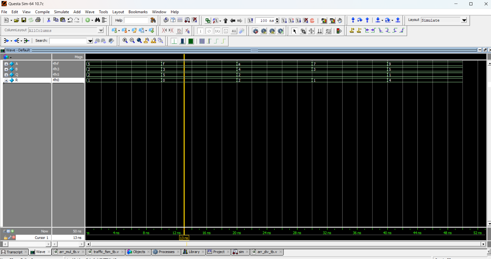

# 🧮 4-Bit Divider

## 📘 Description
The **4-bit divider** takes a 4-bit dividend and divisor as inputs and produces:
- **Quotient (Q)**: 4-bit output
- **Remainder (R)**: 4-bit output  

This implementation uses Verilog's built-in division (`/`) and modulo (`%`) operators.  
⚠️ Note: This is not the most hardware-efficient implementation but works well for simulation and learning.

---
| Dividend (A) | Divisor (B) | Quotient (Q) | Remainder (R) |
| ------------ | ----------- | ------------ | ------------- |
| 0101 (5)     | 0010 (2)    | 0010 (2)     | 0001 (1)      |
| 1111 (15)    | 0011 (3)    | 0101 (5)     | 0000 (0)      |
| 1010 (10)    | 0100 (4)    | 0010 (2)     | 0010 (2)      |
| 0111 (7)     | 0011 (3)    | 0010 (2)     | 0001 (1)      |

📊 Simulation Output

For A=5, B=2 → Q=2, R=1

For A=15, B=3 → Q=5, R=0

For A=10, B=4 → Q=2, R=2

For A=7, B=3 → Q=2, R=1

Waveform will show how quotient and remainder change for each input.

## 📝 Code

[arr_div.v]( arr_div.v) – RTL Design  

[arr_div_tb.v]( arr_div_tb.v) – Testbench  

## 🔍 Simulation

- Tool: QuestaSim / EDA Playground  

- ### 📊 Waveform Output

Here is the simulation waveform:  

Output Verified!

