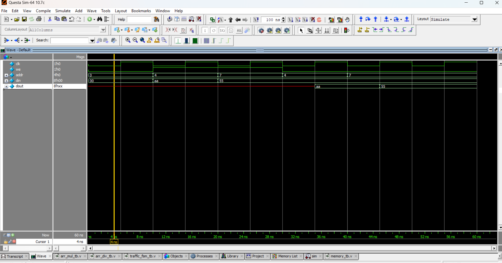

# 💾 Simple RAM (Memory Model)

## 📘 Description
This is a **simple 16x8 RAM model** implemented in Verilog.  
- **16 locations** (address range: 0–15)  
- **8-bit data width**  
- Supports **read** and **write** operations.  

⚠️ This is a **behavioral model**, mainly for simulation and learning purposes.

---

📝 Example Operation

Write 10101010 at address 0011 (3)

Read back from address 0011 → Output should be 10101010

📊 Simulation Output

Write 0xAA at address 4 → Read back gives 0xAA

Write 0x55 at address 7 → Read back gives 0x55

## 📝 Code

[memory.v]( memory.v) – RTL Design  

[memory_tb.v]( memory_tb.v) – Testbench  

## 🔍 Simulation

- Tool: QuestaSim / EDA Playground  

- ### 📊 Waveform Output

Here is the simulation waveform:  

Output Verified!

