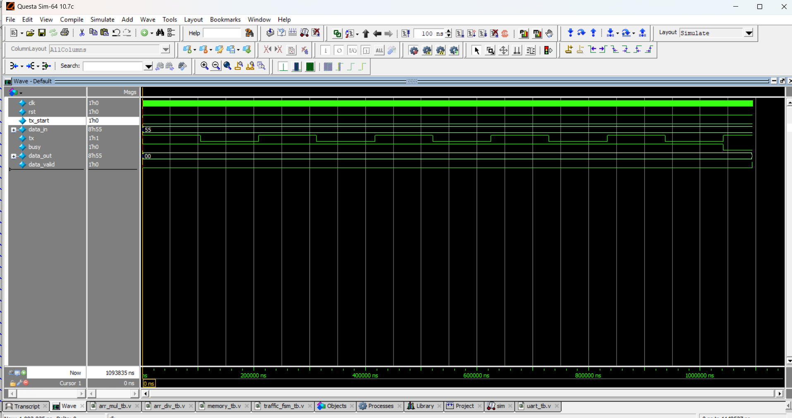

# 📡 UART Transmitter & Receiver (8-bit)

## 📘 Description
UART (Universal Asynchronous Receiver/Transmitter) is a **serial communication protocol** widely used in embedded systems.  
This project implements a **basic UART Transmitter and Receiver** in Verilog.

- **Baud rate**: Configurable (via clock divider)  
- **Data width**: 8 bits  
- **Frame format**:  
  - 1 Start bit (`0`)  
  - 8 Data bits (LSB first)  
  - 1 Stop bit (`1`)  

---
📝 Example Timing

For data 01010101 (0x55) transmission:

Frame = Start(0) + 01010101 + Stop(1)

TX line will output: 0 10101010 1
📊 Simulation Output

Tx sends: 0x55 (01010101)

Rx receives: 0x55

Data matches ✅

## 📝 Code

[uart.v]( uart.v) – RTL Design  

[uart_tb.v]( uart_tb.v) – Testbench  

## 🔍 Simulation

- Tool: QuestaSim / EDA Playground  

- ### 📊 Waveform Output

Here is the simulation waveform:  

Output Verified!

